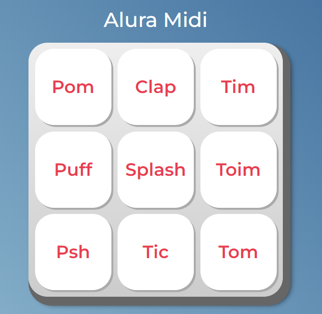

## 
 Alura Midi

* Projeto: https://diegonf.github.io/Studies__FrontEndJS__Alura-Midi/
* Curso: JavaScript para Web: Crie páginas dinâmicas!
* Instituição: [Alura](https://www.alura.com.br)

## Descrição do projeto
O Projeto Alura Midi foi desenvolvido no curso JavaScript para Web: Crie páginas dinâmicas, da Formação Front-End da Alura.
O objetivo desse projeto foi aprofundar os conhecimentos da linguagem javascript, manipular o DOM utilizando o JS, e trabalhar com a lógica de programação para criar um teclado musical, com teclas que acionam um elemento de audio do HTML com link para um som específico.

## Funcionalidades
* Teclas (botôes) que acionam seu respectivo som.

## Tecnologias utilizadas
*  
* 
* 

## Autores
| [ Diego Ferreira](https://github.com/diegonf) | 
| :---: |